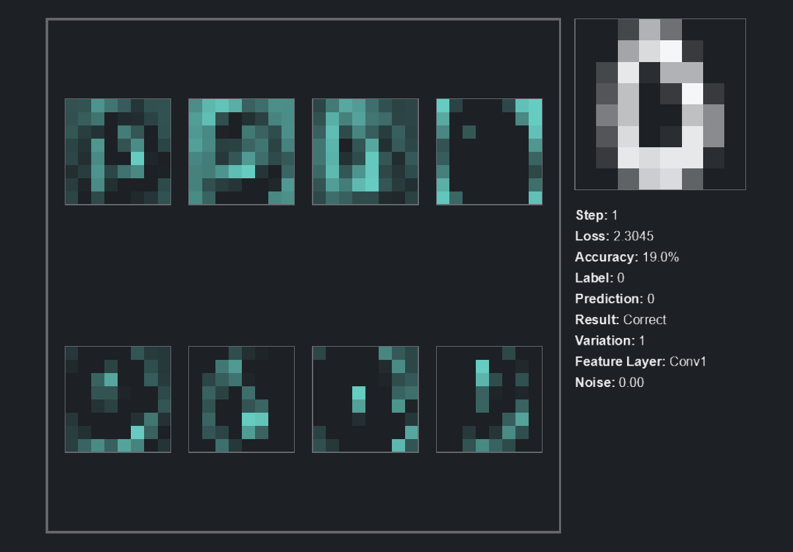

# nn-toybox

Tiny visual neural-network toybox in PyTorch + Arcade.

## What Is nn-toybox?

`nn-toybox` is an eight-demo collection for watching small neural networks learn, organize, compress, generate, inspect, attend, and optimize. The main experience is live training: pick a demo, run `display`, and watch the model move.

The project is intentionally complete at eight demos for now.

## Clips

<p align="center">
  
</p>
<p align="center">
  
</p>

## Quick Start

```bash
python -m scripts.display --demo grad --dataset moons
python -m scripts.display --demo embed
python -m scripts.display --demo encode
python -m scripts.display --demo diffuse --dataset gaussian-mixtures
python -m scripts.display --demo trace
python -m scripts.display --demo conv
python -m scripts.display --demo attend
python -m scripts.display --demo optim
```

Installable console scripts point at the same entrypoints:

```bash
nn-toybox-display --demo grad --dataset moons
nn-toybox-run --demo trace --steps 1000
```

## Main Experience: Display

`display` opens Arcade and trains live. Arcade is UI only; PyTorch and NumPy own the data, model, and training logic.

```bash
python -m scripts.display --demo grad --dataset moons --seed 0 --steps-per-frame 4
python -m scripts.display --demo diffuse --dataset gaussian-mixtures --preset nice
python -m scripts.display --demo trace --dataset digits8 --top-k-edges 160
python -m scripts.display --demo attend --trap-rate 0.75
python -m scripts.display --demo optim --landscape hidden_well --optimizer momentum
```

Common controls:

- `Space`: pause or resume
- `R`: reset with the same seed
- `N`: increment the seed and restart
- `S`: save a checkpoint and artifacts
- `1`, `2`, `3`: change training speed
- `Esc`: quit

Arrow keys follow one shared convention where possible: up/down rotate datasets or within-dataset variations, and left/right rotate model or algorithm choices. Digit demos use up/down for variations of the current digit and left/right for digit classes.

## Headless: Run

`run` never opens Arcade. It is for CI, smoke checks, reproducibility, checkpoints, and static artifacts.

```bash
python -m scripts.run --demo grad --dataset moons --steps 1000
python -m scripts.run --demo embed --steps 1000
python -m scripts.run --demo encode --steps 1000
python -m scripts.run --demo diffuse --dataset gaussian-mixtures --steps 1000
python -m scripts.run --demo trace --steps 1000
python -m scripts.run --demo conv --steps 1000
python -m scripts.run --demo attend --steps 1000
python -m scripts.run --demo optim --steps 500
```

## V1 Learning Path

Learning -> Geometry -> Compression -> Generation

| Step | Demo | Concept | What to look at |
| --- | --- | --- | --- |
| 1 | `grad` | Learning | Decision boundaries, loss, gradients, optimizer behavior |
| 2 | `embed` | Geometry | Similarity, clusters, nearest neighbors, representation quality |
| 3 | `encode` | Compression | Bottlenecks, reconstruction, latent structure |
| 4 | `diffuse` | Generation | Noise schedules, denoising, sample formation |

## V2 Follow-On Demos

Inference paths -> Seeing -> Context -> Training dynamics

| Step | Demo | Concept | What to look at |
| --- | --- | --- | --- |
| 5 | `trace` | Inference paths | Input pixels, hidden activations, edge contributions, output probabilities |
| 6 | `conv` | Seeing | Learned filters, feature maps, class probabilities |
| 7 | `attend` | Choosing context | Masked sentence, attention links, subject vs distractor, target vs prediction |
| 8 | `optim` | Training dynamics | Loss landscapes, optimizer trails, loss curves |

`autoencode` is accepted as a friendly demo alias for `encode`; `encode` is the canonical name.

## Demo Dataset Pairing

| Demo | Dataset |
| --- | --- |
| `grad` | `Distributions` |
| `embed` | `Text - Tiny Semantics`, `Text - Big Tiny Semantics` |
| `encode` | `Images - Icons`, `Images - Patterns` |
| `diffuse` | `Distributions` |
| `trace` | `Digits - 8x8 Mini` |
| `conv` | `Digits - 8x8 Mini` |
| `attend` | `Text - Subject Verb Agreement` |
| `optim` | `Optimization - Loss Landscapes` |

`Distributions` is one dataset choice in the picker. `grad` and `diffuse` rotate through its variants with up/down arrows.

## Data Policy

Synthetic data is the default. There are no required internet downloads.

- `grad`: generated 2D distributions. Friendly aliases include `moons`, `circles`, `spirals`, `rings`, `gaussian-mixtures`, and `checkerboard`.
- `embed`: hand-written tiny semantic text graphs: `Text - Tiny Semantics` and `Text - Big Tiny Semantics`.
- `encode`: generated image icons and patterns. `icons` is accepted as a friendly alias.
- `diffuse`: generated 2D point-cloud distributions.
- `trace` and `conv`: `Digits - 8x8 Mini`, accepted as `digits8`, `digits`, or `8x8-digits`.
- `attend`: synthetic subject-verb agreement sentences.
- `optim`: analytic loss landscapes under `Optimization - Loss Landscapes`.

The bundled digits asset is one zip at `assets/digits8_mini_8x8.zip`. It contains native 8x8 grayscale PNGs: 500 train images and 100 disjoint inference images. The loader reads PNGs from the zip with `zipfile` and PIL, scales them visually with nearest-neighbor drawing, and does not extract or commit hundreds of image files.

Unknown datasets fail early with the unknown value plus valid canonical names and friendly aliases. Invalid demo/dataset pairings also fail early; for example, `optim` only accepts the loss-landscape dataset.

## Visual Language

The demos share one quiet Arcade style: neutral background, teal/aqua accents, restrained greys, outlined diamond-square marks, fixed panels, and compact status text. Individual demos can decide what they show, but they reuse the shared primitives instead of inventing new shapes.

Arcade owns drawing and input. The trainers remain headless and testable.

## Artifacts

Headless runs write to `runs/<demo>/<run-name>/`:

- `config.json`: resolved config
- `metrics.json`: final metrics
- `checkpoint.pt`: final model checkpoint where relevant
- `artifacts/`: NumPy exports and static preview images when implemented

The primary workflow is live training through `display`, not opening a saved run.

## Tests

```bash
python -m pytest
python -m scripts.smoke --output-dir runs/_smoke
```

Tests and smoke paths are CPU-only, headless, and download-free. They exercise the shared run entrypoint, registry, packaged digits loader, and each demo trainer snapshot.

## Design Boundaries

This is not a full deep-learning course or a dataset zoo. For this version, keep the scope to the current eight demos.

Do not add MNIST downloads, HuggingFace datasets, Tiny Shakespeare, GANs, VAEs, a full transformer demo, RNNs, plugin machinery, or complex config frameworks.

Suggested GitHub topics: `pytorch`, `arcade`, `neural-networks`, `visualization`, `education`, `machine-learning`, `diffusion`, `embeddings`.
