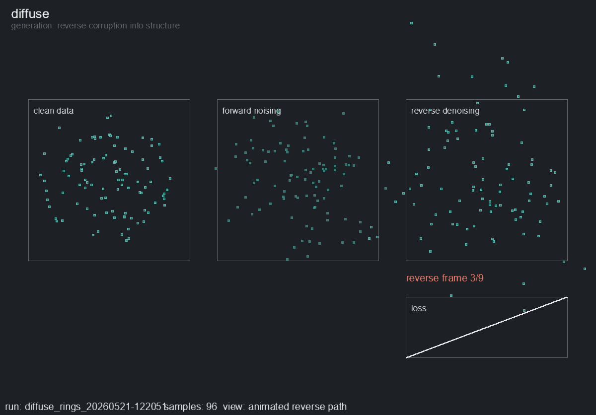

# nn-toybox

`nn-toybox` is a compact visual neural-network toybox in PyTorch and Arcade.

The main experience is live training: pick a demo, run `display`, and watch the model learn.

Working slogan: **Learning -> Geometry -> Compression -> Generation**

## Clips

<p align="center">
  
</p>
<p align="center">
  
</p>

## Quick Start

Main experience:

```bash
python -m nn_toybox.display --demo grad --dataset "Distributions - Moons"
python -m nn_toybox.display --demo embed
python -m nn_toybox.display --demo encode
python -m nn_toybox.display --demo diffuse --dataset "Distributions - Gaussian Mixtures"
python -m nn_toybox.display --demo trace
python -m nn_toybox.display --demo conv
python -m nn_toybox.display --demo attend
python -m nn_toybox.display --demo optim
```

Headless training and export:

```bash
python -m nn_toybox.run --demo grad --dataset "Distributions - Moons" --steps 1000
python -m nn_toybox.run --demo embed --steps 1000
python -m nn_toybox.run --demo encode --steps 1000
python -m nn_toybox.run --demo diffuse --dataset "Distributions - Gaussian Mixtures" --steps 1000
python -m nn_toybox.run --demo trace --steps 1000
python -m nn_toybox.run --demo conv --steps 1000
python -m nn_toybox.run --demo attend --steps 1000
python -m nn_toybox.run --demo optim --steps 500
```

`display` opens Arcade and trains live. `run` never opens Arcade; it is for CI, reproducibility, checkpoints, and static artifacts.

## Mental Model

- `demo` selects the toy: `grad`, `embed`, `encode`, `diffuse`, `trace`, `conv`, `attend`, or `optim`.
- Arcade is UI only.
- PyTorch and NumPy own model, data, and training.
- A small registry connects each demo config, trainer, and renderer.
- CI uses the shared `train` and trainer paths, not viewer checkpoints.

Common flags work across demos:

```bash
python -m nn_toybox.display --demo grad --dataset "Distributions - Moons" --seed 0 --steps-per-frame 4
python -m nn_toybox.run --demo diffuse --dataset "Distributions - Gaussian Mixtures" --steps 1000 --seed 1
```

Demo-specific flags stay small:

```bash
python -m nn_toybox.display --demo grad --boundary-resolution 96
python -m nn_toybox.display --demo embed --embedding-dim 2
python -m nn_toybox.display --demo encode --latent-dim 4
python -m nn_toybox.display --demo diffuse --sample-timesteps 8
python -m nn_toybox.display --demo diffuse --preset nice
python -m nn_toybox.display --demo trace --top-k-edges 160
python -m nn_toybox.display --demo conv --channels 8 --noise-amount 0.08
python -m nn_toybox.display --demo attend --trap-rate 0.75
python -m nn_toybox.display --demo optim --landscape two_basins --optimizer momentum
```

## Learning Path

| Step | Demo | Concept | What to look at |
| --- | --- | --- | --- |
| 1 | `grad` | Learning | Decision boundaries, loss, gradients, optimizer behavior |
| 2 | `embed` | Geometry | Similarity, clusters, nearest neighbors, representation quality |
| 3 | `encode` | Compression | Bottlenecks, reconstruction, latent structure |
| 4 | `diffuse` | Generation | Noise schedules, denoising, sample formation |

V2 adds four inspectable follow-ons:

| Demo | Concept | What to look at |
| --- | --- | --- |
| `trace` | Inference paths | Input pixels, hidden activations, edge contributions, output probabilities |
| `conv` | Seeing | Learned filters, feature maps, class probabilities |
| `attend` | Choosing context | Masked sentence, attention links, subject vs distractor, target vs prediction |
| `optim` | Training dynamics | Loss landscapes, optimizer trails, loss curves |

## Display Controls

- `Space`: pause or resume
- `R`: reset with the same seed
- `N`: increment the seed and restart
- `S`: save a checkpoint and artifacts
- `1`, `2`, `3`: change training speed
- `Esc`: quit

Some V2 demos add local controls:

- `trace`: left/right browse variations of the same digit, up/down switch digits, `G` random example, `E` toggle edges
- `conv`: left/right browse variations of the same digit, up/down switch digits, `G` random example, `V` feature layer, `M` noise level
- `attend`: `G` new sentence, `H` cycle attention row
- `optim`: `O` optimizer, `L` landscape, `G` new start, `+`/`-` learning rate

## Artifacts

Headless runs write to `runs/<demo>/<run-name>/`:

- `config.json`: resolved config
- `metrics.json`: final metrics
- `checkpoint.pt`: final model checkpoint
- `artifacts/`: NumPy exports and static preview images when implemented

The primary workflow is live training through `view`, not opening a saved run. Checkpoint loading can be added later without becoming the main path.

## Repo Layout

- `nn_toybox/run.py`: shared headless entrypoint wrapper
- `nn_toybox/display.py`: shared Arcade live-training entrypoint wrapper
- `scripts/train.py`: original shared headless entrypoint
- `scripts/view.py`: original shared Arcade live-training entrypoint
- `core/config.py`: shared config/dataclass/CLI helpers
- `core/registry.py`: tiny explicit demo registry
- `demos/<name>/`: per-demo `config`, `trainer`, `renderer`, `model`, and `data`
- `nn_toybox/shared/digits8.py`: zip-backed loader for the bundled tiny digits asset
- `core/`: shared Arcade view, checkpoints, plotting, generated data, and utilities

## Data Policy

V1 is synthetic by default and requires no downloads.

- `grad`: Distributions - Blobs, Distributions - Gaussian Mixtures, Distributions - Circles, Distributions - Rings, Distributions - Moons, Distributions - XOR, Distributions - Checkerboard, Distributions - Spiral
- `embed`: Text - Tiny Semantics, Text - Big Tiny Semantics
- `encode`: Images - Icons, Images - Patterns
- `diffuse`: generated 2D point clouds such as Distributions - Gaussian Mixtures, Distributions - Rings, Distributions - Moons, Distributions - Checkerboard, and Distributions - Spiral
- `trace` and `conv`: Digits - 8x8 Mini from `assets/digits8_mini_8x8.zip`
- `attend`: Text - Subject Verb Agreement, synthetic subject-verb agreement sentences
- `optim`: synthetic analytic loss landscapes

The bundled digits asset contains native 8x8 grayscale PNGs: 500 train images and 100 disjoint inference images. The loader reads PNGs from the zip with `zipfile` and PIL, visualizes them with nearest-neighbor scaling, and does not extract or commit hundreds of image files.

The attend demo uses tiny generated sentences such as `the dogs near the cat [MASK] noisy`, `near the cats , the dog [MASK] noisy`, and `today the dog behind the cats [MASK] loud`. The target is `are` or `is` based on the true subject, not the closer distractor noun. As training improves, the `[MASK]` attention should shift toward the true subject.

Dataset CLI values use the exact canonical names listed above; aliases such as `moons`, `digits8`, or `8x8 digits` are intentionally not accepted. Demo/dataset pairings are validated by the shared entrypoints. For example, `optim` only accepts `Optimization - Loss Landscapes`; passing `Digits - 8x8 Mini` to `optim` fails early instead of silently running the synthetic optimizer landscape.

Diffuse defaults to a fast Gaussian Mixtures live preset: 512 training points, 16 training timesteps, 8 preview timesteps, 64 preview samples, and sparse cached drawing. Use `--preset nice` for the heavier/slower preview settings.

Optional downloaded datasets can be future TODOs, not core behavior.

## Smoke Check

```bash
python -m nn_toybox.run --demo grad --dataset "Distributions - Moons" --steps 5 --smoke
python -m nn_toybox.run --demo diffuse --dataset "Distributions - Gaussian Mixtures" --steps 5 --smoke
python -m nn_toybox.run --demo trace --steps 5 --smoke
```

Smoke checks use CPU-only trainers and the shared headless run path. They do not open Arcade windows.
