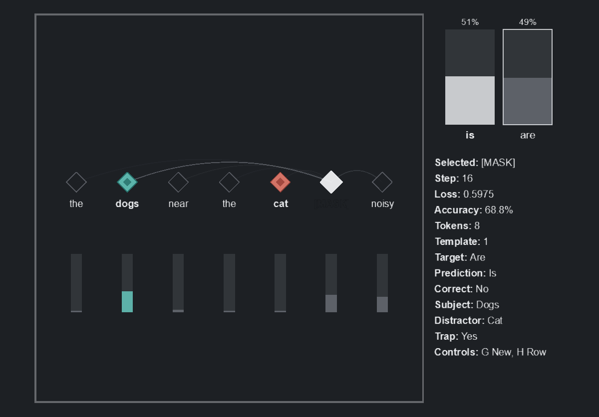

# attend

Purpose: show attention as choosing context.

`attend` trains a tiny single-head self-attention model on synthetic subject-verb agreement sentences. It predicts whether the masked verb should be `is` or `are`.

## Clip



## In Simple Terms

The sentence contains a true subject and a nearby distractor noun:

```text
the dogs near the cat [MASK] noisy
```

The target is `are`, because the verb agrees with `dogs`, not the closer noun `cat`. The model must learn which word matters for the masked verb.

## What The Model Does

Default shape:

```text
Token ids
Token embedding + positional embedding
Single self-attention head
Tiny classifier from the [MASK] token representation
Output: is / are logits
```

Sentences are generated from small static tables. Several templates move the subject, distractor, and mask around, so fixed-position shortcuts are less useful. A configurable trap rate makes the distractor often have the opposite number from the subject.

This is a tiny self-attention toy, not a language model and not a full transformer.

## What To Look For Visually

- Token cells across the main panel.
- The `[MASK]` row or links emphasized.
- The true subject marked as the correct source.
- The distractor marked as the tempting nearby wrong source.
- The strongest attention shifting toward the subject as training improves.
- Secondary `is`/`are` bars separating as confidence grows.

## Important Knobs

- `--trap-rate`
- `--embedding-dim`
- `--attention-dim`
- `--batch-size`
- `--lr`
- `--steps-per-frame`

Display controls:

- `G`: generate/show a new sentence
- `H`: cycle highlighted attention row
- `Space`: pause/resume
- `R`: reset

## Failure Cases Worth Trying

```bash
python -m scripts.display --demo attend --steps 30
python -m scripts.display --demo attend --trap-rate 1.0
python -m scripts.display --demo attend --embedding-dim 4 --attention-dim 4
```

Short training keeps attention noisy. Very small dimensions make the agreement rule harder to settle cleanly.

## Display Command

```bash
python -m scripts.display --demo attend
```

## Headless Run Command

```bash
python -m scripts.run --demo attend --steps 1000
```
