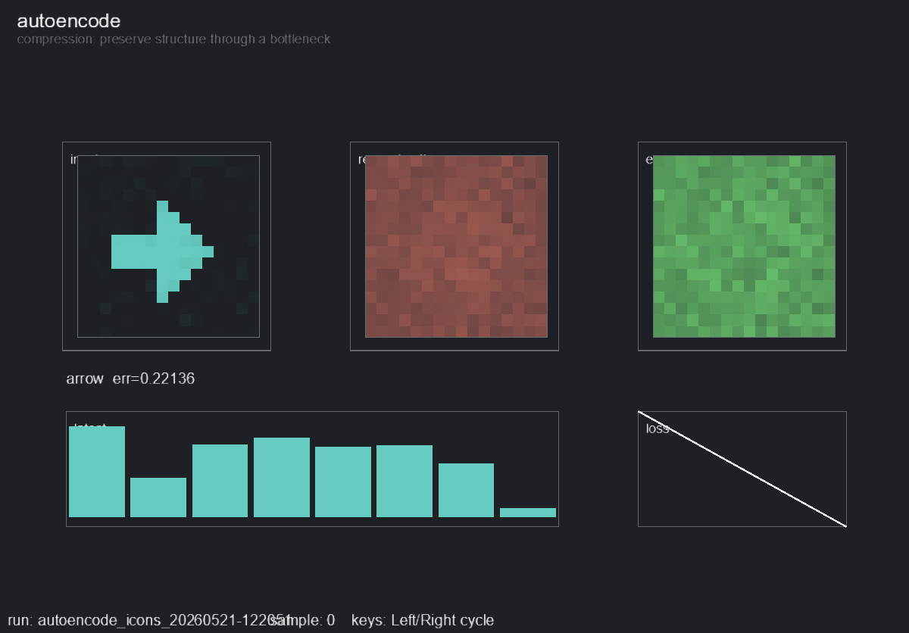

# autoencode

Purpose: show how a neural network compresses and reconstructs data.

`autoencode` trains a tiny fully connected autoencoder on generated 16x16 image datasets. V1 includes `Images - Icons` and `Images - Patterns`.

## Clip



## In Simple Terms

The model is asked to copy an image, but it has to squeeze the image through a small bottleneck first. That bottleneck is the latent vector.

If the bottleneck is useful, the model keeps the important structure and reconstructs the image. If it is too small, too noisy, or trained too briefly, the reconstruction loses pixels, blurs shapes, or forgets identity.

## Neural Network Shape

Default topology:

```text
Input: 16x16 image flattened to 256 numbers
Encoder: 256 -> 64 -> 8
Latent: 8 numbers
Decoder: 8 -> 64 -> 256
Output: reconstructed 16x16 image
```

That is `256 -> 64 -> 8 -> 64 -> 256`, with **34,184 trainable parameters**.

The final decoder layer uses `Sigmoid`, so output pixels stay in the `0..1` range. Training minimizes mean squared reconstruction error.

Defaults:

- Image Size: `16`
- Hidden Dim: `64`
- Latent Dim: `8`
- Samples: `512`
- Noise: `0.02`
- Learning Rate: `0.003`
- Loss: mean squared error

## Commands

```bash
python -m scripts.view --demo autoencode
python -m scripts.view --demo autoencode --dataset "Images - Patterns"
python -m scripts.view --demo autoencode --latent-dim 2
python -m scripts.view --demo autoencode --latent-dim 16 --hidden-dim 96

python -m scripts.train --demo autoencode --steps 1000
python -m scripts.capture_demo --demo autoencode
```

## Look For

- Which pixels survive reconstruction.
- Whether shape identity survives the bottleneck.
- How the latent bars change across samples.
- Whether sample error falls as the reconstruction gets closer to the original.

## Knobs

- `--dataset`: `Images - Icons`, `Images - Patterns`
- `--latent-dim`
- `--hidden-dim`
- `--image-size`
- `--n-samples`
- `--noise`
- `--lr`
- `--steps-per-frame`

## Failure Cases Worth Trying

```bash
python -m scripts.view --demo autoencode --latent-dim 1
python -m scripts.view --demo autoencode --noise 0.15
python -m scripts.view --demo autoencode --hidden-dim 16
```
