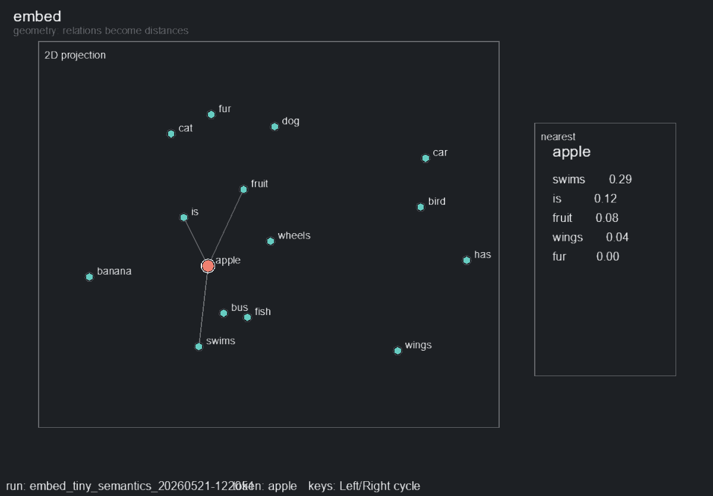

# embed

Purpose: show how embeddings turn relationships into geometry.

`embed` trains a tiny embedding table on hand-written semantic relation corpora covering animals, vehicles, food, and tools:

```text
cat is_a animal
eagle has wings
truck used_for carry
train moves_on rail
apple tastes sweet
hammer made_of metal
spoon used_for eat
```

## Clip



## In Simple Terms

An embedding is a small list of numbers that represents a token. At the start, tokens are placed randomly. During training, related tokens are pulled toward each other and unrelated tokens are pushed apart.

The live view turns those learned numbers into a 2D map. If training works, words with similar roles drift into nearby neighborhoods: `cat`, `dog`, and `fur`; `car`, `bus`, and `wheels`; `apple`, `banana`, and `fruit`.

## Neural Network Shape

Default topology:

```text
Token Id -> Embedding Table -> 2D Vector
Score(left, right) = dot(left_vector, right_vector)
```

For the default `Text - Tiny Semantics` corpus, there are 77 tokens and `embedding_dim = 2`, so the model has **154 trainable parameters**.

There are no hidden layers. The whole model is the embedding table. The dot product is trained to be high for positive relation pairs and low for sampled negative pairs.

Defaults:

- Embedding Dim: `2`
- Negative Samples: `3`
- Noise Pairs: `0`
- Learning Rate: `0.05`
- Loss: binary cross entropy with logits

## Commands

```bash
python -m scripts.view --demo embed
python -m scripts.view --demo embed --dataset "Text - Big Tiny Semantics"
python -m scripts.view --demo embed --noise-pairs 4
python -m scripts.view --demo embed --embedding-dim 3

python -m scripts.train --demo embed --steps 1000
python -m scripts.capture_demo --demo embed
```

## Look For

- Nearest neighbors for each token.
- Object/property clusters such as `cat`, `dog`, and `fur`.
- Category geometry around `apple`, `banana`, and `fruit`.
- How injected noisy pairs distort the space.

## Knobs

- `--dataset`: `Text - Tiny Semantics`, `Text - Big Tiny Semantics`
- `--embedding-dim`
- `--negative-samples`
- `--noise-pairs`
- `--lr`
- `--steps-per-frame`

## Failure Cases Worth Trying

```bash
python -m scripts.view --demo embed --noise-pairs 8
python -m scripts.view --demo embed --embedding-dim 1
python -m scripts.train --demo embed --steps 20
```
