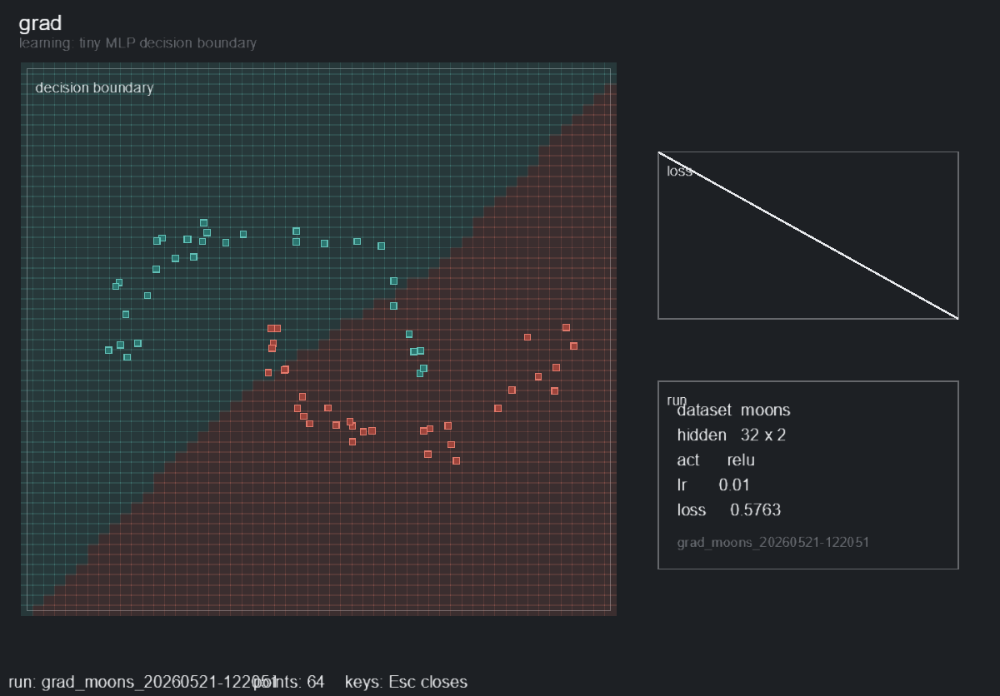

# grad

Purpose: show how a neural network learns a decision boundary.

`grad` trains a tiny classifier on generated 2D point clouds. The live view shows the data points, the current decision boundary, and a loss curve as the model updates.

## Clip



## In Simple Terms

Each point has an `x` and `y` position plus a class label. The network sees batches of points, guesses their class, compares the guess with the real label, and nudges its weights to make the next guess better.

The decision boundary is the visible result of those nudges. When training works, the colored regions bend until they separate the point groups. When training struggles, the boundary gets stuck, wobbles, or stays too simple for the dataset.

## Neural Network Shape

Default topology for two-class datasets:

```text
Input: 2D point
Linear 2 -> 32
ReLU
Linear 32 -> 32
ReLU
Linear 32 -> 2
Output: class logits
```

That is `2 -> 32 -> 32 -> 2`, with **1,218 trainable parameters**.

The output layer changes with the dataset class count. Hidden size, number of hidden layers, activation, optimizer, and learning rate are configurable.

Defaults:

- Hidden Dim: `32`
- Layers: `2`
- Activation: `relu`
- Optimizer: `adam`
- Learning Rate: `0.01`
- Batch Size: `128`
- Loss: cross entropy

## Commands

```bash
python -m nn_toybox.display --demo grad --dataset "Distributions - Moons"
python -m nn_toybox.display --demo grad --dataset "Distributions - Spiral" --hidden-dim 64 --activation tanh
python -m nn_toybox.display --demo grad --dataset "Distributions - Checkerboard" --lr 0.03 --optimizer sgd

python -m nn_toybox.run --demo grad --dataset "Distributions - Moons" --steps 1000
python -m scripts.capture_demo --demo grad --dataset "Distributions - Moons"
```

## Look For

- How the decision boundary wraps around points.
- Whether the loss curve is smooth, stuck, or unstable.
- How spirals and checkerboards need more capacity than blobs.
- How too much noise or a bad learning rate breaks a tiny model.

## Knobs

- `--dataset`: `Distributions - Blobs`, `Distributions - Gaussian Mixtures`, `Distributions - Circles`, `Distributions - Rings`, `Distributions - Moons`, `Distributions - XOR`, `Distributions - Checkerboard`, `Distributions - Spiral`
- `--hidden-dim`
- `--layers`
- `--activation`
- `--optimizer`
- `--lr`
- `--noise`
- `--boundary-resolution`
- `--steps-per-frame`

## Failure Cases Worth Trying

```bash
python -m nn_toybox.display --demo grad --dataset "Distributions - Spiral" --hidden-dim 8
python -m nn_toybox.display --demo grad --dataset "Distributions - Moons" --lr 1.0
python -m nn_toybox.display --demo grad --dataset "Distributions - Checkerboard" --layers 1
```
