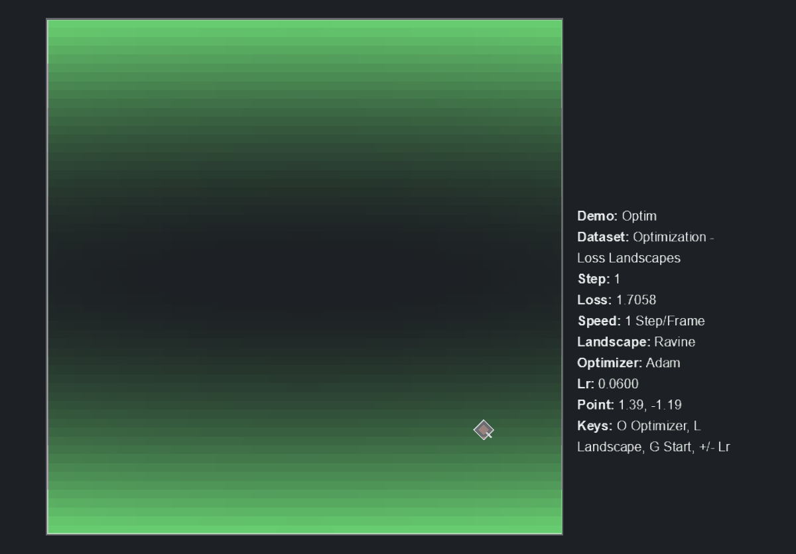

# optim

Purpose: show optimizer motion through loss landscapes.

`optim` is a NumPy demo where a point moves through a 2D analytic loss surface. It compares how SGD, momentum, and Adam choose different paths.

## Clip



## In Simple Terms

Training is movement through a landscape. The current parameter point has a loss value, the gradient points downhill, and the optimizer decides how large and how directed the next step should be.

Different optimizers can take very different trails on the same surface.

## What The Demo Does

There is no neural network in this demo. The trainer evaluates analytic loss functions and gradients directly, then updates a 2D parameter point.

Landscapes include easy bowls, ravines, saddles, two basins, noisy bowls, hidden wells, narrow passes, and ripple traps with local minima that differ from the global one.

## What To Look For Visually

- The current point moving across the landscape.
- The trail showing optimizer history.
- Dense mesh lines where the landscape gets deeper.
- Local minima that catch an optimizer before it reaches the global basin.
- Loss curves flattening, oscillating, or dropping sharply.

## Important Knobs

- `--landscape`
- `--optimizer`
- `--lr`
- `--momentum`
- `--start-x`
- `--start-y`
- `--trail-length`

Display controls:

- Up/down: rotate landscapes
- Left/right: rotate optimizers
- `G`: new start point
- `+`/`-`: change learning rate
- `R`: reset

## Failure Cases Worth Trying

```bash
python -m scripts.display --demo optim --landscape ravine --optimizer sgd --lr 0.08
python -m scripts.display --demo optim --landscape ripple_traps --optimizer momentum
python -m scripts.display --demo optim --landscape hidden_well --optimizer adam --lr 0.01
```

High learning rates can overshoot. Momentum can carry the point through shallow turns or into traps. Adam often moves steadily, but it can still settle in the wrong basin.

## Display Command

```bash
python -m scripts.display --demo optim
```

## Headless Run Command

```bash
python -m scripts.run --demo optim --steps 500
```
