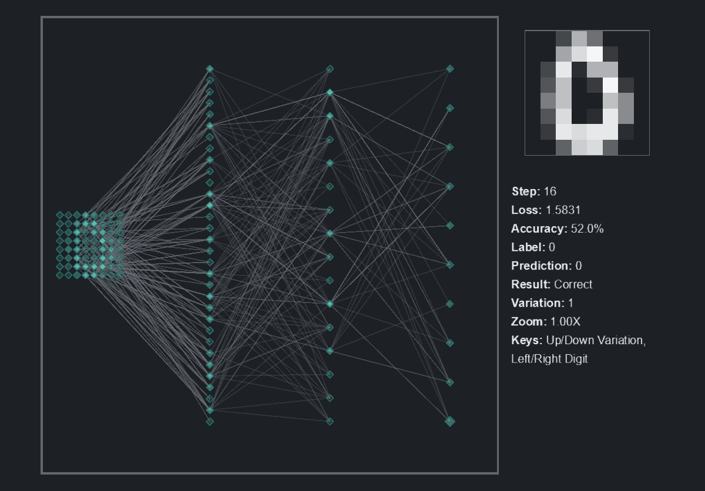

# trace

Purpose: show how a trained neural network turns an input into an output.

`trace` trains a tiny MLP on the bundled zipped 8x8 digits, then lets you browse disjoint inference digits while the network graph lights up.

## Clip



## In Simple Terms

Each digit is 64 input pixels. Bright pixels activate input nodes, hidden units glow by activation, and output bars show the model's digit probabilities.

Edges glow by contribution: a connection is bright when its weight and upstream activation are pushing strongly into the next neuron. Weak edges may be hidden or heavily faded so the view reads like energy flowing through a learned circuit instead of a hairball.

## What The Model Does

Default topology:

```text
Input: 8x8 digit flattened to 64 numbers
Linear 64 -> 32
ReLU
Linear 32 -> 16
ReLU
Linear 16 -> 10
Output: digit logits
```

Training uses `digits8_mini/train`. The display browses `digits8_mini/inference`, which is disjoint from the training split.

## What To Look For Visually

- Input pixels glowing on the left side of the network.
- Hidden neurons lighting up in compact patterns.
- Grey links changing transparency by contribution strength.
- Output bars concentrating on the predicted digit.
- Wrong predictions standing out when the highlighted prediction differs from the true digit.

## Important Knobs

- `--top-k-edges`
- `--hidden-dim`
- `--batch-size`
- `--lr`
- `--steps-per-frame`

Display controls:

- Up/down: browse variations of the same digit
- Left/right: switch digit classes
- `G`: random inference example
- `E`: toggle edge detail

## Failure Cases Worth Trying

```bash
python -m scripts.display --demo trace --steps 20
python -m scripts.display --demo trace --top-k-edges 20
python -m scripts.run --demo trace --steps 50
```

Very short training makes uncertain output bars and inconsistent paths. Very low edge counts make the circuit easier to read but can hide useful secondary evidence.

## Display Command

```bash
python -m scripts.display --demo trace
```

## Headless Run Command

```bash
python -m scripts.run --demo trace --steps 1000
```
